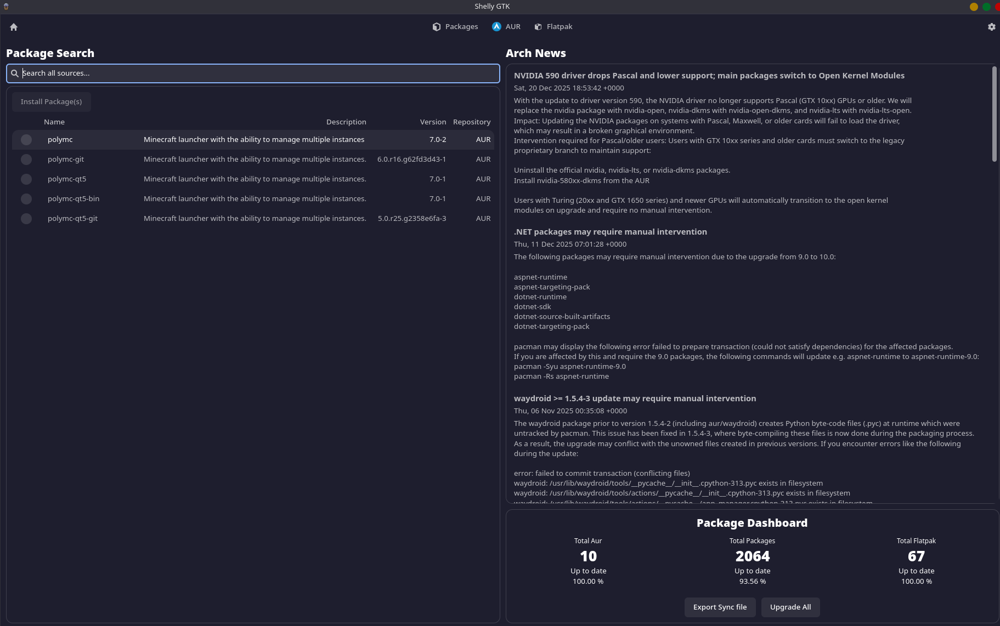
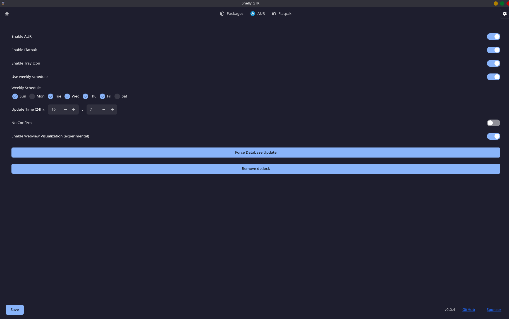
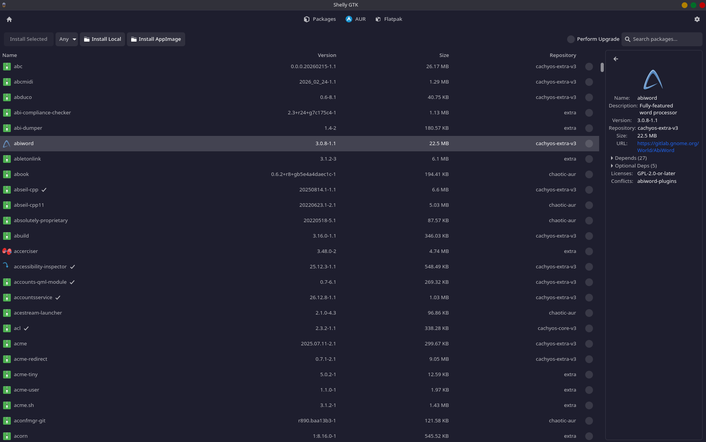
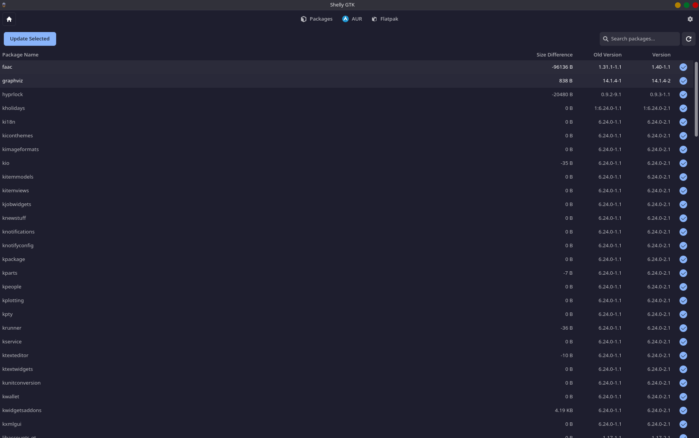
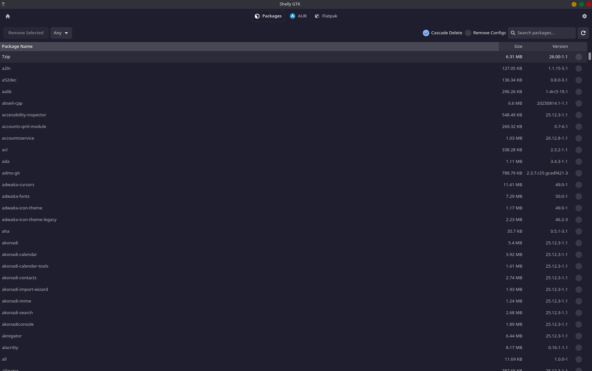
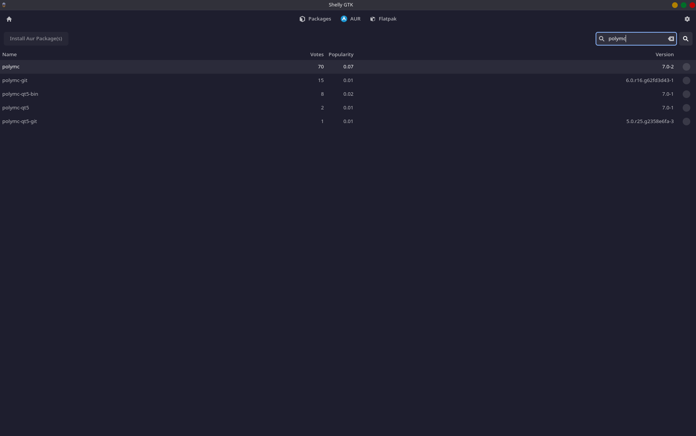
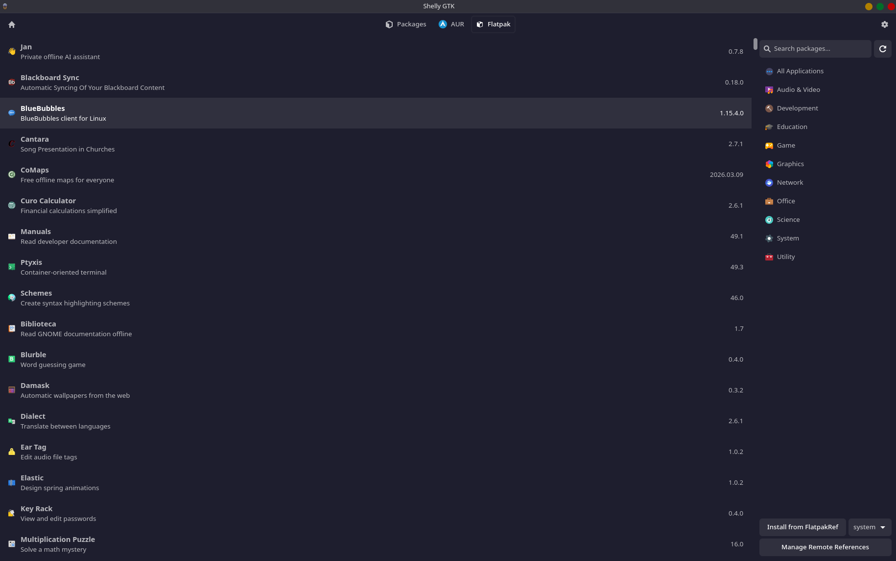
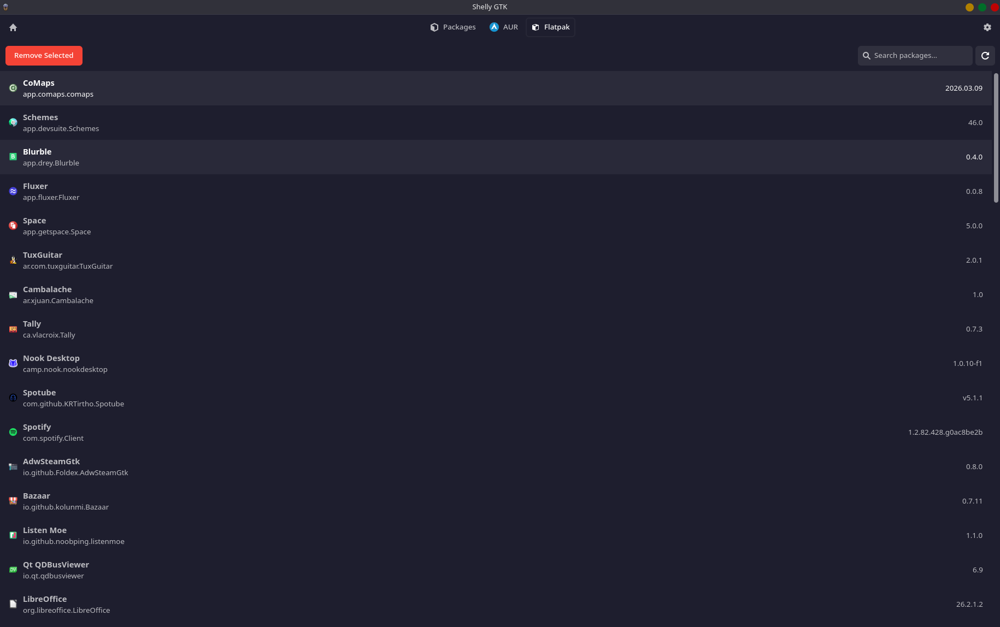
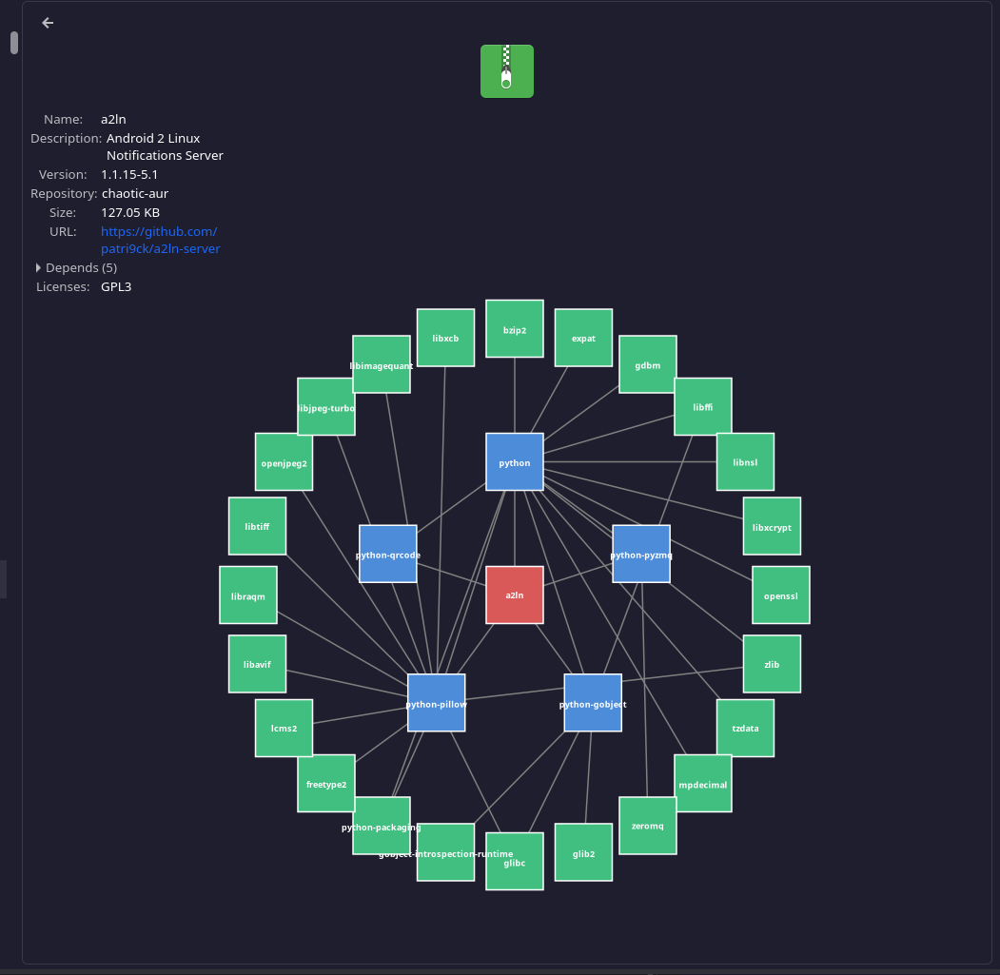

# Why Shelly?

### Shelly is a user centric experience made to streamline the user experience of managing their programs in Arch Linux. It offers a comprehensive user experience to find, install, update, track, and remove software on Linux.

## Installing Shelly

If you have the cachyOS repos or Chaotic AUR repos you can do:

```bash
sudo pacman -S shelly
```


You can use a AUR helper:

```bash
yay -S shelly
```

or

```bash
paru -S shelly
```

## Using Shelly

## Home Page

When you Open shelly you will start on the home page. This Page has three major screens to reference.

Arch News - Sharing the ten most recent articles from https://archlinux.org/news/ allowing you to stay up to date on Arch updates.
Shelly Search - Search all enabled sources (Flatpak, Aur and Packages) in 1 place.
Package Dashboard - A listing of all installs in 3 standard supported formats: AUR, Packages, and Flatpak. Underneath it has the percentage of installs currently up to date.

You can return to the home page at any time by clicking the house in the top left. Finally the search function here will search all sources rather than specifically Packages, AUR, or Flatpak.



## Settings
At the Top right of the screen select the gear to enter into settings, here you can enable several features of Shelly.

Enable AUR - Allows access to the AUR download features, these packages are managed by individual users so access at your own risk

Enable Flatpack - Turns on Shelly's flatpak management

Enable Tray Icons sets an icon on your taskbar to allow you to open shelly without using the terminal and keeps shelly open

Tray Check Interval or Day / Week schedule - This will set a time for shelly to check for updates and prompt you with a notice of update's currently avalible. Example if set to 24 hours once a day shelly inform you how many updates are pending.

No confirmation - Shelly will accept all requests for packages and will not ask you to confirm any choices or inputs that you make

Force Database Update - Forces shelly to sync with all of your databases and will grab a fresh list of all available packages

Remove db.lock - If a transaction fails and you are locked from doing more installs clicking remove db.lock it will bypass the failure allowing you to proceed

Once you have made your selections click save in the bottom left to lock all choices.

Sometimes experimental settings may be added, they are not guaranteed to work and may be removed at any time. They will be marked with (experimental)



## Packages

At the top of the screen you can select Packages, this will create a dropdown with three options.

Install Packages - Search and install packages, select which packages to install by selecting the checkbox on the right side and select install selected in top left to install.

Next to install selected there are several unique options to packages

Any - Listing all groups created in the repository you are using, you can select these groups to get more targeted packages

Install Local - Select a file on your computer and install it, will create sim links/opt allowing you to access the files via your terminal while not putting them in the bin.

Install AppImage - Same as Install except down with AppImage file rather than local file.

Update Packages - List of all packages with updates available, screen starts with all selected, you can uncheck packages to not include in update, when satisfied select update selected in top left to update all selected packages.

Manage Packages - List of all current installed packages, their size and version. Any packages you select the check box on can be uninstalled by clicking the Remove Selected in the top left.





## AUR
Next to packages you will see AUR (If you turned on AUR in settings, if you have no reference the settings for how to turn on AUR). Like Packages there are three options in the dropdown with similar functions. AUR are managed by single users, download at your own discretion.

Install AUR - Search and install AUR , this will search all AUR from the repository. There is no listing to search so you will need to know the files you are looking for. There is an upcoming feature with a trust rating, this will not be a guarantee but should be some level of warning regarding files.

Update AUR - List of all AUR with updates available, screen starts with all selected, you can uncheck AUR to not include in update, when satisfied select Update AUR Packages in top left to update all selected packages.

Remove AUR - List of all current installed AUR and versions. Any AUR you select the check box on the right can be uninstalled by clicking the Remove AUR Packages in the top left.



## Flatpak
Next to either packages or AUR depending on what you have activated you should see Flatpak (if you do not go to the settings section to reference how to turn on Flatpak). Like Packages and AUR there are 3 sections.

Install Flatpak - Search and install Flatpak , this will search all Flatpak hosted by Flatpak from the repository. On the right side is a category search, you can select a category or type in a name to find the flatpak you wish to install. Double click the flatpak to see a small preview then on the top right of the screen you can select install.

Unique to this page there is a Manage Remote References in the bottom right, this allows you to add other Flatpak repositories. Click into Manage Remote references and there is an option to delete any you wish to remove with Delete Selected Remote on the top right. Next to it is Add Remote allowing you to add a repository, all you need to provide is a name and a URL.

Update Flatpak - List of all Flatpak with updates available. You can only update all flatpaks or none, there is no ability to select multiple. Click Update All in the top left to update all Flatpak’s

Remove Flatpak - List of all current installed packages and versions. Flatpaks must be uninstalled individually, select a flatpak and then click Remove Selected in the top left to uninstall, repeat until all flatpaks you wish to are uninstalled. 





### Advanced Features (Disabled by default)

Webview visualization of depdency tree



This is still a wip feature check in for future updates. 

You can install the AUR package shelly-git to get the latest features. This will match what is currently in the master branch. This is not recommended for regular use as it could have unstable features.